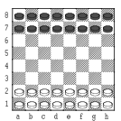
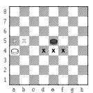

#  *Torneio AlfaBeta BreakThrough (Avanço)*
## Introdução à Inteligência Artificial (2022-23)
### Projecto para avaliação

## Breakthrough

[Dan Troyka](https://mancala.fandom.com/wiki/William_Daniel_Troyka) criou este jogo em 2000, ganhando o prémio para melhor jogo de tabuleiro 8x8 em 2001. É um jogo com regras bastante simples, mas que exige uma boa estratégia para ter sucesso. Podem experimentar o jogo [aqui](https://crypto.stanford.edu/~blynn/play/breakthrough.html).

### Tabuleiro inicial
Um tabuleiro quadrado 8x8, 16 peças brancas e 16 peças pretas.

### Objectivo
Um jogador ganha se chegar com uma das suas peças à primeira linha do adversário, ou seja, as Brancas devem chegar à 8ª linha e as Pretas à 1ª linha do tabuleiro.

### Movimentos

Cada jogador, alternadamente, move uma peça sua. Começam as Brancas.
As peças movem-se sempre em frente, para uma casa vazia, seja na sua coluna ou numa das suas diagonais.

No diagrama seguinte mostra-se para onde cada uma das peças se poderia movimentar se fosse a sua vez de jogar.

As peças podem capturar peças adversárias que se situem na sua diagonal em frente movendo-se para a casa onde elas se encontram (como os peões do Xadrez).

As peças capturadas são removidas do tabuleiro. As capturas são opcionais e apenas se pode capturar uma peça por turno (ou seja, não há capturas múltiplas).

No diagrama seguinte observa-se quais as peças pretas que poderiam ser capturadas pela peça branca (a peça branca não se pode mover para d6 porque a casa está ocupada, nem pode capturar essa peça preta, porque as capturas apenas se efetuam na diagonal.

As partidas deste jogo terminam rapidamente, porque as peças são obrigadas a mover-se sempre para a frente. Em cada turno, cada jogador tem pelo menos uma jogada possível (o adversário não consegue bloquear peças, assim, a peça mais avançada pode sempre deslocar-se). Deste modo, as partidas nunca terminam em empate.
